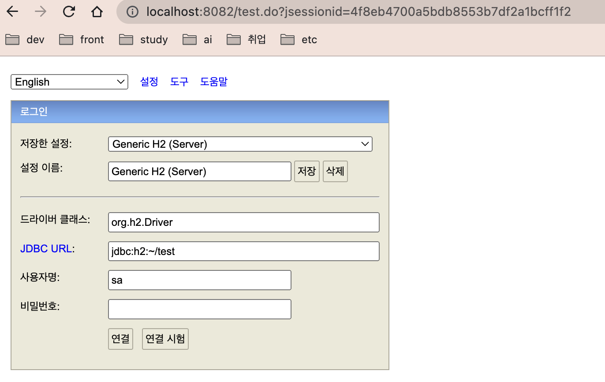

## H2 DB 설정
1. 다운 : https://h2database.com
2. 폴더 ~/study 에서 압축 풀기 (편한 폴더로)
3. ~/study/bin/h2/bin 폴더에 있는 h2.sh 실행
```
$zsh ~/bin/study/h2/bin
$zsh ./h2.sh

단, 권한 denied가 발생 한다면 해당 bin 폴더 위치에서 권한 설정후 재 실행
$zsh chmod 755 h2.sh
$zsh ./h2.sh
```

4. chrome 실행 시 로딩이 안된다면 localhost:8082 or 127.0.0.1:8082 http://localhost:8082/ 로 접속
5. 초기 설정

지정한 설정 : Generic H2 (Server)
접속 JDBC URL : jdbc:h2:~/test
이후 JDBC URL : jdbc:h2:tcp://localhost/~/test
6. 기본 table 생성
``````
drop table; // 필요하는 테이블 제거
create table Member (
    id bigint not null,
    name varchar(255),
    primary key (id)
); // Member 테이블 생성
``````